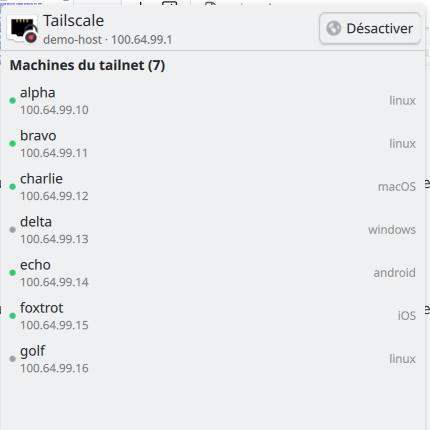

# plasmoid-tailscale

A KDE Plasma 6 applet for [Tailscale](https://tailscale.com/): status, toggle, peers list — right from your system tray.

## Features

- System tray icon reflecting the Tailscale backend state (connected / disconnected)
- Popup with:
  - Your machine's hostname and Tailscale IP
  - **Activate / Deactivate** button (`pkexec tailscale up|down`, Polkit-prompted)
  - List of peers in your tailnet, with online/offline dot and OS hint
  - Click a peer → copies its Tailscale IP to the clipboard
- **Middle-click** the tray icon → quick toggle without opening the popup
- Tooltip shows current state + IP + peer count
- Polls `tailscale status --json` every 5 s (via Plasma's `executable` DataSource)
- **Simulation mode** built-in: show a fake tailnet (NATO-phonetic hostnames, CGNAT IPs) for demos / screenshots / dev without Tailscale installed

## Screenshots



_Screenshot taken with **simulation mode** enabled (see [Simulation mode](#simulation-mode)) — NATO-phonetic hostnames and CGNAT IPs from the fixture, not from a real tailnet._

## Requirements

- KDE Plasma **6.0+**
- [Tailscale](https://tailscale.com/kb/installation) installed with the `tailscale` CLI in `$PATH`
- `pkexec` (from `policykit-1`) for toggle commands — default on most Linux distros
- A working Polkit setup (any desktop session has one)

## Installation

### Manual

```bash
git clone https://github.com/s-celles/plasmoid-tailscale.git
mkdir -p ~/.local/share/plasma/plasmoids/org.scelles.tailscale
cp -r plasmoid-tailscale/{metadata.json,contents} \
      ~/.local/share/plasma/plasmoids/org.scelles.tailscale/
kbuildsycoca6 --noincremental
```

Then right-click your panel or system tray → **Add Widgets** → search **Tailscale** → drag into place.

### Using `kpackagetool6`

```bash
git clone https://github.com/s-celles/plasmoid-tailscale.git
kpackagetool6 -t Plasma/Applet -i plasmoid-tailscale/
```

### Adding to the system tray automatically

The applet declares `X-Plasma-NotificationArea: true`, so it appears in the tray widget chooser. To enable it headlessly:

```bash
# Discover the containment ID of your system tray
APPLETSRC="$HOME/.config/plasma-org.kde.plasma.desktop-appletsrc"
SID=$(awk '
  /^\[Containments\]\[[0-9]+\]$/ { id = $0; gsub(/[^0-9]/, "", id); current = id; in_cont = 1; next }
  /^\[/ { in_cont = 0; next }
  /^plugin=org\.kde\.plasma\.private\.systemtray$/ && in_cont { print current; exit }
' "$APPLETSRC")

for key in extraItems knownItems; do
  cur=$(kreadconfig6 --file plasma-org.kde.plasma.desktop-appletsrc \
        --group Containments --group "$SID" --group General --key "$key")
  case ",$cur," in
    *,org.scelles.tailscale,*) ;;
    *) kwriteconfig6 --file plasma-org.kde.plasma.desktop-appletsrc \
         --group Containments --group "$SID" --group General \
         --key "$key" "${cur:+$cur,}org.scelles.tailscale" ;;
  esac
done
kquitapp6 plasmashell && setsid plasmashell >/dev/null 2>&1 < /dev/null &
```

## Simulation mode

Right-click the applet → **Configure Tailscale…** → enable **Simulation mode**. The applet then ignores the real `tailscale` CLI and renders fixture data:

- `demo-host · 100.64.99.1` as the self entry
- Seven peers named **alpha, bravo, charlie, delta, echo, foxtrot, golf** with CGNAT IPs under `100.64.99.0/24` and a mix of OS and online/offline states
- Toggle still works — it flips a local `BackendState` between `Running` and `Stopped`, no `tailscale up/down` is ever invoked

Use it for:

- Taking screenshots without leaking real hostnames / IPs
- Demoing the applet on a machine where Tailscale isn't installed
- UI development — no network round-trips, predictable state

You can also tune the polling interval from the same settings page (default 5 s).

## How it works

| Piece | Purpose |
|---|---|
| `metadata.json` | Plasma 6 package descriptor, declares systray eligibility |
| `contents/ui/main.qml` | All of the logic: `PlasmoidItem` with `compactRepresentation` (tray icon) and `fullRepresentation` (popup) |
| `contents/config/main.xml` | KConfigXT schema declaring `simulationMode` + `pollIntervalMs` |
| `contents/config/config.qml` + `contents/ui/configGeneral.qml` | Settings dialog (right-click → Configure) |
| `P5Support.DataSource` (engine `executable`) | Runs `tailscale status --json` and parses the JSON |
| `TextEdit` helper | Copies peer IPs to the clipboard via `selectAll() + copy()` |

Polling uses a configurable timer (default 5 s, tunable in settings). Toggle commands are fire-and-forget through `pkexec`; once they return, a refresh is scheduled via `Qt.callLater`.

## Limitations

- Toggle requires a Polkit password prompt each time. If you run `tailscale up --operator=$USER` once, `tailscale up/down` works without `pkexec` — the applet does **not** strip `pkexec` automatically (future enhancement).
- No exit-node picker yet.
- No MagicDNS / services discovery view.
- On Wayland, `TextEdit.copy()` needs a visible focus grab on some compositors; tested working on KWin/Wayland Plasma 6.

## Development

```bash
# Live reload — replace the installed plasmoid and restart plasmashell
cp -r metadata.json contents \
      ~/.local/share/plasma/plasmoids/org.scelles.tailscale/
kquitapp6 plasmashell && setsid plasmashell >/dev/null 2>&1 < /dev/null &
```

Debug logs from QML end up on plasmashell's stderr (use `journalctl --user -f` or redirect plasmashell output when restarting).

To develop without Tailscale installed or without touching a real tailnet, enable **Simulation mode** (see [above](#simulation-mode)). The fixture data lives inline in `main.qml` — edit `fixtureStatus` to test edge cases (empty tailnet, slow Self, exotic OS names, etc.).

## Packaging a release

```bash
# Produces org.scelles.tailscale.plasmoid (a zip with the correct structure)
zip -r org.scelles.tailscale.plasmoid metadata.json contents/
```

Upload that to [store.kde.org](https://store.kde.org/) under *Plasma 6 Addons → Plasma Widgets → Network*.

## License

[MIT](./LICENSE) © 2026 Sébastien Celles

## See also

- [Tailscale](https://tailscale.com/)
- [KDE Plasma 6 applet documentation](https://develop.kde.org/docs/plasma/widget/)
- [awesome-tailscale](https://github.com/tailscale-dev/awesome-tailscale)
